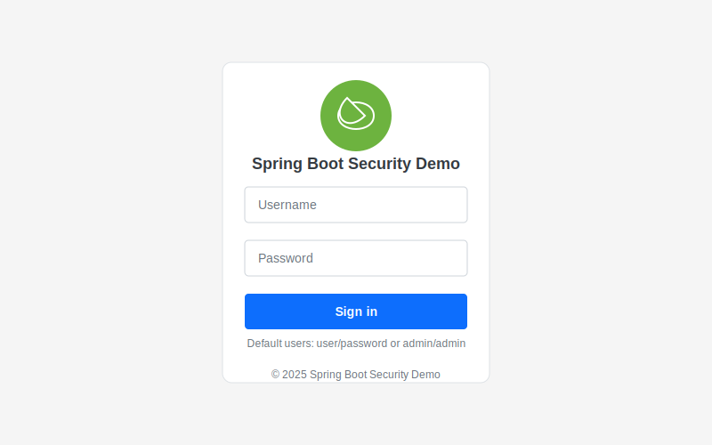
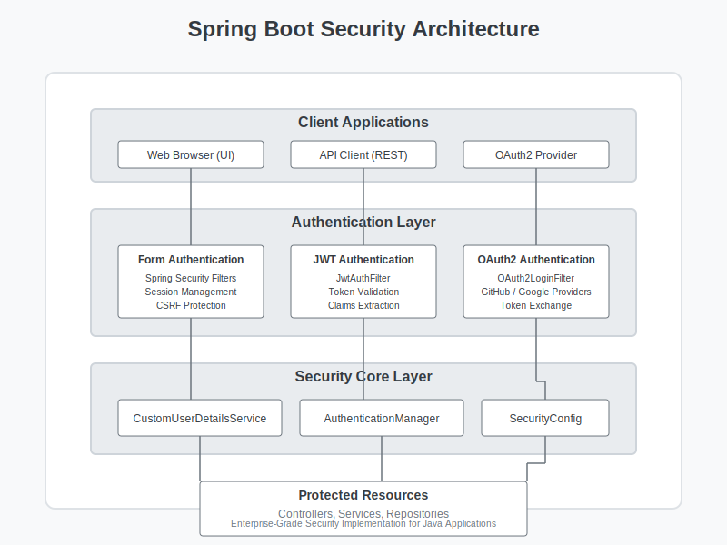

# Spring Boot Security Demo

[](https://opensource.org/licenses/MIT)
[](https://www.docker.com/)
[](https://spring.io/projects/spring-boot)
[](https://spring.io/projects/spring-security)
[](https://jwt.io/)
[](https://oauth.net/2/)

A comprehensive Spring Boot Security demonstration showcasing enterprise-grade authentication and authorization mechanisms. This project implements JWT-based authentication for RESTful APIs alongside OAuth2 social login integration - all containerized with Docker for seamless deployment and scalability.



> This project demonstrates advanced Java security architecture, containerization expertise, and enterprise application design - key skills for senior Java development and DevOps engineering positions.

## Security Features

- **JWT Authentication** for stateless API security
  - Token generation, validation, and extraction
  - Role-based claims and permissions
  - Token refresh mechanisms

- **OAuth2 Integration** for social login
  - GitHub and Google provider support with configurable client credentials
  - Customizable authentication flow with provider-specific attributes
  - Seamless integration with Spring Security's filter chains
  - Multi-provider authentication with unified user experience

- **Comprehensive Security Architecture**
  - Form-based authentication for web UI
  - Bearer token authentication for APIs
  - Role-based access control (USER, ADMIN)
  - Security filter chain with proper configuration

- **Modern Tech Stack**
  - Spring Boot 3.4.5 with Java 17
  - Spring Security 6 with latest security practices
  - Thymeleaf + Bootstrap 5 for responsive UI
  - Docker containerization for deployment

## Local Development

### Prerequisites

- Java 17
- Maven 3.8+
- Docker and Docker Compose

### Build and Run with Maven

```bash
# Build the application
mvn clean package

# Run the application
mvn spring-boot:run
```

The application will be available at [http://localhost:8080](http://localhost:8080)

### Default Users

- Regular user: username=`user`, password=`password` (ROLE_USER)
- Admin user: username=`admin`, password=`admin` (ROLE_ADMIN, ROLE_USER)

## Docker Deployment

### Building the Docker Image

```bash
# Build the image
docker build -t spring-security-demo .
```

### Running the Container

```bash
# Run the container
docker run -p 8080:8080 spring-security-demo
```

### Using Docker Compose

```bash
# Build and start the application
docker-compose up -d

# View logs
docker-compose logs -f

# Stop the application
docker-compose down
```

## Container Features

This Docker deployment demonstrates several best practices:

1. **Multi-stage builds** - Separate build and runtime stages to reduce final image size
2. **Security hardening** - Running as non-root user with principle of least privilege
3. **Health checks** - Regular monitoring of application health via Spring Actuator
4. **Resource constraints** - CPU and memory limits to improve stability
5. **Environment configuration** - Externalized configuration via environment variables
6. **Volume mounting** - Persistent storage for logs
7. **Network isolation** - Custom bridge network
8. **Secrets management** - Secure handling of OAuth client credentials and JWT secrets

## API Documentation

### Authentication Endpoints

```http
POST /api/auth/login
```

**Description**: Authenticates a user and returns a JWT token

**Request Body**:

```json
{
  "username": "user",
  "password": "password"
}
```

**Response**:

```json
{
  "token": "eyJhbGciOiJIUzI1NiJ...",
  "type": "Bearer",
  "expiresIn": 3600
}
```

### Protected Resources

```http
GET /api/resource/user
```

**Description**: Returns user-specific resources (requires USER role)

**Headers**: `Authorization: Bearer {token}`

```http
GET /api/resource/admin
```

**Description**: Returns admin-specific resources (requires ADMIN role)

**Headers**: `Authorization: Bearer {token}`

## Security Architecture

This project implements a comprehensive security architecture:



### Authentication Flow

1. **Form-Based Authentication**:
   - User submits credentials via web form
   - Spring Security authenticates against the user database
   - Upon successful authentication, user is directed to the dashboard

2. **JWT Authentication**:
   - Client sends credentials to `/api/auth/login`
   - Server validates credentials and issues a signed JWT token
   - Client includes the token in the `Authorization` header for subsequent requests
   - `JwtTokenUtil` validates tokens and extracts user details

3. **OAuth2 Authentication**:
   - User selects a social login provider (GitHub or Google)
   - User is redirected to the provider for authorization
   - Provider redirects back with an authorization code
   - Spring Security exchanges the code for an access token
   - Access token is used to fetch user details and create a local user session
   - User identity is federated across multiple authentication systems

### Security Components

- **JwtTokenUtil**: Generates and validates JWT tokens
- **JwtAuthenticationFilter**: Intercepts requests and validates JWT tokens
- **SecurityConfig**: Configures security filter chains for web and API endpoints
- **OAuth2LoginSuccessHandler**: Custom handler for successful OAuth2 logins

## Cloud Deployment Considerations

This application is designed for deployment to cloud platforms such as:

- **AWS ECS/EKS**: Containerized deployment with managed Kubernetes
- **Azure Container Apps**: Serverless container runtime with scaling
- **Google Cloud Run**: Stateless containerized applications
- **Heroku Container Runtime**: Simple deployment of Docker containers

## Skills Demonstrated

This project showcases several skills that are valuable for senior engineering roles:

1. **Advanced Spring Security Implementation**
   - JWT-based authentication for RESTful APIs
   - OAuth2 integration with multiple providers
   - Role-based access control

2. **Java Development Expertise**
   - Spring Boot configuration and customization
   - Java 17 language features
   - API design and implementation

3. **Enterprise Architecture Patterns**
   - Stateless authentication
   - Layered security architecture
   - Separation of concerns

4. **DevOps and Containerization**
   - Docker multi-stage builds
   - Container orchestration with Docker Compose
   - Deployment optimization and security hardening

## License

This project is licensed under the MIT License - see the LICENSE file for details.

## OAuth2 Provider Setup

### GitHub OAuth2 Setup

1. Create a GitHub OAuth App:
   - Go to GitHub → Settings → Developer settings → OAuth Apps → New OAuth App
   - Set Application name: `Spring Boot Security Demo`
   - Homepage URL: `http://localhost:8080`
   - Authorization callback URL: `http://localhost:8080/login/oauth2/code/github`
   - Click "Register application"

2. Configure application.properties:

   ```properties
   # GitHub OAuth2 Configuration
   spring.security.oauth2.client.registration.github.client-id=YOUR_GITHUB_CLIENT_ID
   spring.security.oauth2.client.registration.github.client-secret=YOUR_GITHUB_CLIENT_SECRET
   spring.security.oauth2.client.registration.github.scope=user:email,read:user
   spring.security.oauth2.client.registration.github.redirect-uri=http://localhost:8080/login/oauth2/code/github
   ```

### Google OAuth2 Setup

1. Create Google OAuth credentials:
   - Go to [Google Cloud Console](https://console.cloud.google.com/)
   - Navigate to APIs & Services → Credentials → Create Credentials → OAuth client ID
   - Select "Web application" as application type
   - Set a name: `Spring Boot Security Demo`
   - Add authorized redirect URI: `http://localhost:8080/login/oauth2/code/google`
   - Click "Create"

2. Configure application.properties:

   ```properties
   # Google OAuth2 Configuration
   spring.security.oauth2.client.registration.google.client-id=YOUR_GOOGLE_CLIENT_ID
   spring.security.oauth2.client.registration.google.client-secret=YOUR_GOOGLE_CLIENT_SECRET
   spring.security.oauth2.client.registration.google.scope=profile,email
   spring.security.oauth2.client.registration.google.redirect-uri=http://localhost:8080/login/oauth2/code/google
   ```

### OAuth2 Production Considerations

- **Secure Credentials Storage**: In production, OAuth client credentials should be stored in secure vaults or environment variables, not in properties files
- **HTTPS Required**: OAuth2 providers require HTTPS for production callback URLs
- **State Parameter Validation**: Ensure proper state parameter handling to prevent CSRF attacks
- **Session Management**: Implement proper session handling for OAuth2 authenticated users
- **Identity Federation**: Consider integration with enterprise identity providers for SSO capabilities

## Next Steps

- Implement CI/CD pipeline with Azure DevOps
- Add monitoring with Prometheus and Grafana
- Implement HTTPS with SSL certificates
- Add database persistence
- Add application metrics and tracing
